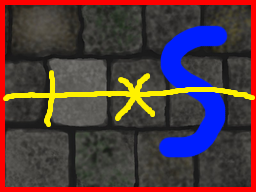

DungeonCrawler-tile-maker
=========================

Generates wall tiles to be used in a 'old school dungeon crawler' like Bard's Tale, Eye of the Beholder and Might And Magic (1-5). 


How to use
----------

You must have an image with a 'front wall'. Feed it to the function and it will generate the tiles.

```python
generate_tiles(source_wall_filename,			# Filename of the original image
			   result_filename, 			 	# Filename of the resulting images
			   depth, 							# How much farther from the front wall you want tiles
               vanishing_point_offset=(0,0), 	# By default, the vanishing point is at the center of
               									# of the image. This is if you want to move it.
               new_size=None, 					# If you want the resulting images to have a different
               									# size.
               source_offset=(0,0), 			# By default, the original image is considered to be 
               									# centered. Use this if you want to move it.
               crop=False						# If you want the resulting images to be cropped.
              )

```

Just run the file. It has an example in it.


Show me stuff!
--------------

From this:


To this:


In the pic above I composed the generated images to show the 'illusion of depth' achieved.


Dependencies
------------

- I started this in Python 2.7 but finished it in 3.3 (don't ask). Still, I believe it runs in both.
- Pillow
- Numpy


Credits
-------

The source image in the repo can be found [here](http://opengameart.org/node/10606) (thanks xmorg), although I butchered it a bit to suit my tests.


TODO
----

- Better documentation
- Add padding to make the size of the images a power of two

